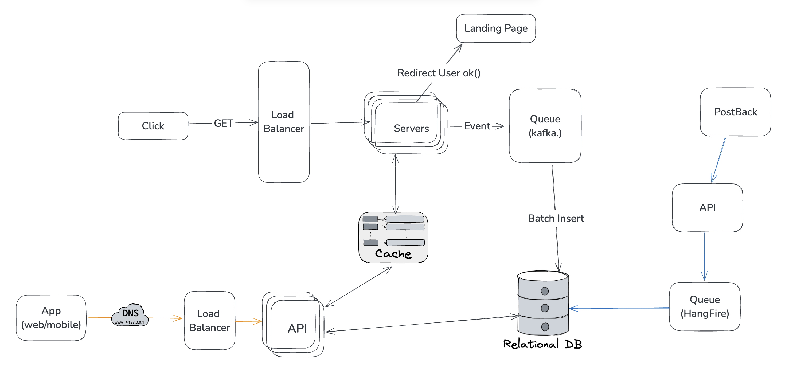

# CPC Exchange Click Handler Flow

sample .Net API to handle high traffic clicks ingestion for a cpc exchange

## System Design



## Architecture

This project implements a simplified AdTech system focused on handling ad clicks and postbacks. The architecture is illustrated in the system diagram and relies on components such as a load balancer, cache, background queues, and a relational database.

### Click Handling Flow

1. **Click Request Received**  
   A user clicks an ad link which hits the Load Balancer via a GET request to the click domain.

2. **Forwarded to Servers**  
   The load balancer routes the request to one of the app servers.

3. **Geo/IP and Device Detection**

   - Geo-location is resolved using **MaxMind.GeoIP2**.
   - Device type (phone, tablet, desktop) is detected using **DeviceDetector.NET**.

4. **Bot Filtering**

   - Bot traffic is filtered at the edge when possible.
   - Additional bot detection is performed at the app layer using user agent parsing.

5. **Cache Lookup**

   - The server attempts to fetch placement and campaign data from **Redis** (via StackExchange.Redis).
   - **No direct DB calls** are made during a click by design.
   - If the cache lookup fails, a cache rebuild is triggered and retried.

6. **Click Routing**

   - The server selects a campaign based on targeting criteria (geo, device, vertical).
   - If no country match is found, the system defaults to a fallback campaign that accepts all countries.

7. **Redirect to Landing Page**  
   The user is redirected to the appropriate campaign landing page.

8. **Event Persistence**

   - In a scalable setup, events would be written to **Kafka**, then batch-inserted into the database.
   - In this example, Kafka is not installed: **clicks are written directly to the DB**.

9. **PostBack Handling**
   - Advertisers send postback calls to the API with the click ID.
   - These are enqueued via **Hangfire** and processed to update conversion data in the relational DB.

### Scheduled Tasks

Scheduled tasks are executed with a **lock mechanism** to prevent concurrent or distributed rebuilds across containers.

These tasks run in a separate container and ensure the cache is always fresh, eliminating the need for database hits during high-traffic operations.

**Intervals and Tasks:**

- **Every 3 minutes:**

  - **Active Campaign Pool:** Rebuilds the cache with only active campaigns from active advertisers.
  - **Active Placements:** Rebuilds the cache with only active placements from active publishers.

- **Every 1 minute:**
  - **Sync Cache:** Refreshes metadata for publishers, advertisers, traffic sources, and subsources.

# How to Install

Clone the repository:

```bash
git clone https://github.com/ouss4m4/AdTechAPI.git
cd AdTechAPI
```

### Run with Docker Compose

Ensure you have Docker and Docker Compose installed. Then run:

```bash
docker-compose up --build
```

### Services Overview

The `docker-compose.yml` includes the following services:

- **api**: The main .NET API application
  - Exposes port `5005` (mapped to internal port `8080`)
  - Depends on `db` and `cache`
- **cli**: A CLI utility container for managing background tasks or maintenance scripts
- **db**: PostgreSQL database (username: `admin`, password: `password`)
- **cache**: Redis instance for caching

The services are connected via a shared `app-network` and the PostgreSQL volume is persisted in `postgres_data`.

### Tech Stack

This project is built using the following technologies:

- **.NET** – for building the main API application
- **PostgreSQL** – as the relational database
- **Redis** – for high-speed caching
- **Hangfire** – for background job processing and scheduled tasks
- **Swagger** – for interactive API documentation
